# Manage and deploy AWS infrastructure using Terraform

<!-- @import "[TOC]" {cmd="toc" depthFrom=1 depthTo=6 orderedList=false} -->
<!-- code_chunk_output -->

* Contents:
    * [Introduction](#introduction)
    * [Repository Structure](#repository-structure)
    * [How to use](#How-to-use)
    * [Result](#Result)
<!-- /code_chunk_output -->


## Introduction

#### This repository will help you build a basic AWS cloud system using Terraform as IAAC and GitHub Actions with the following components:
1. **VPC** 
   - **Subnets:** Include both Public Subnet (connected to the Internet Gateway) and Private Subnet (using a NAT Gateway for external connections).
   - **Internet Gateway:** Connect to the Public Subnet to allow resources inside to access the Internet.
   -  Default **Security Group** for the VPC.		
2. **Route Tables:** 
   - **Public Route Table:** Route Internet traffic through the Internet Gateway.
   - **Private Route Table:** Route Internet traffic through the NAT Gateway.
3. **NAT Gateway:** 
   - Allow resources in the Private Subnet to connect to the Internet while maintaining security.
4. **EC2:** 
 - Create instances in both Public and Private Subnets:
   - **Public instances** can be accessed from the Internet 
   - **Private instances** can only be accessed from the Public instance via SSH or other secure methods.
5. Security Groups: control the inbound/outbound traffic of EC2 instances 
   - **Public EC2 Security Group:** Only allow SSH (port 22) connections from a specific IP (or the user’s IP).
   - **Private EC2 Security Group:** Allow connections from the Public EC2 instance via the required port (SSH or other ports if needed).


## Repository structure
```txt
|─ .github
│  └─ workflows
│     └─ github-actions-demo.yml
|
└─ exercise1
   ├─ modules
   │  ├─ EC2
   │  │  ├─ main.tf
   │  │  ├─ output.tf
   │  │  └─ variable.tf
   │  ├─ NAT
   │  │  ├─ main.tf
   │  │  ├─ output.tf
   │  │  └─ variable.tf
   │  ├─ Route_Table
   │  │  ├─ main.tf
   │  │  ├─ output.tf
   │  │  └─ variable.tf
   │  ├─ Security_Group
   │  │  ├─ main.tf
   │  │  ├─ output.tf
   │  │  └─ variable.tf
   │  └─ VPC
   │     ├─ main.tf
   │     ├─ output.tf
   │     └─ variable.tf
   ├─ tests
   │  └─ setup
   │     └─ main.tf
   │  ├─ EC2.tftest.hcl
   │  ├─ NAT.tftest.hcl
   │  ├─ Rout_Table.tftest.hcl
   │  ├─ Security_group.tftest.hcl
   │  ├─ VPC.tftest.hcl
   |─ terraform.tfvars.tf
   |─ variable.tf
   ├─ output.tf
   ├─ .terraform.lock.hcl
   ├─ local.tf
   ├─ main.tf
```
## How to use
### **Setup:**

1. **Clone the Repository:**
   ```bash
   git clone https://github.com/howtodie123/Terraform.git
   cd exercise1/Terraform
   ```

1. **Create AWS S3 Bucket:**
   - Go to the S3 service in AWS.
   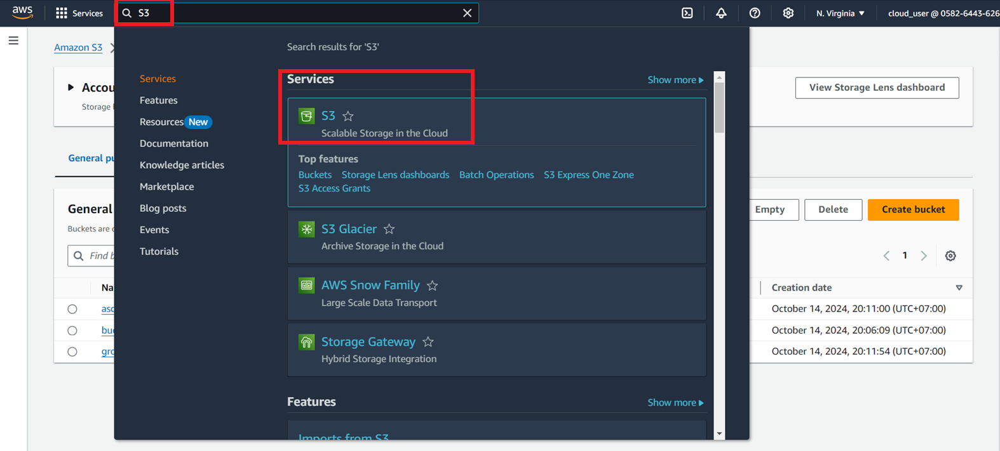

   - Go to ``Buckets`` section and click create.
   - add ``bucket name`` and save that name to use.
   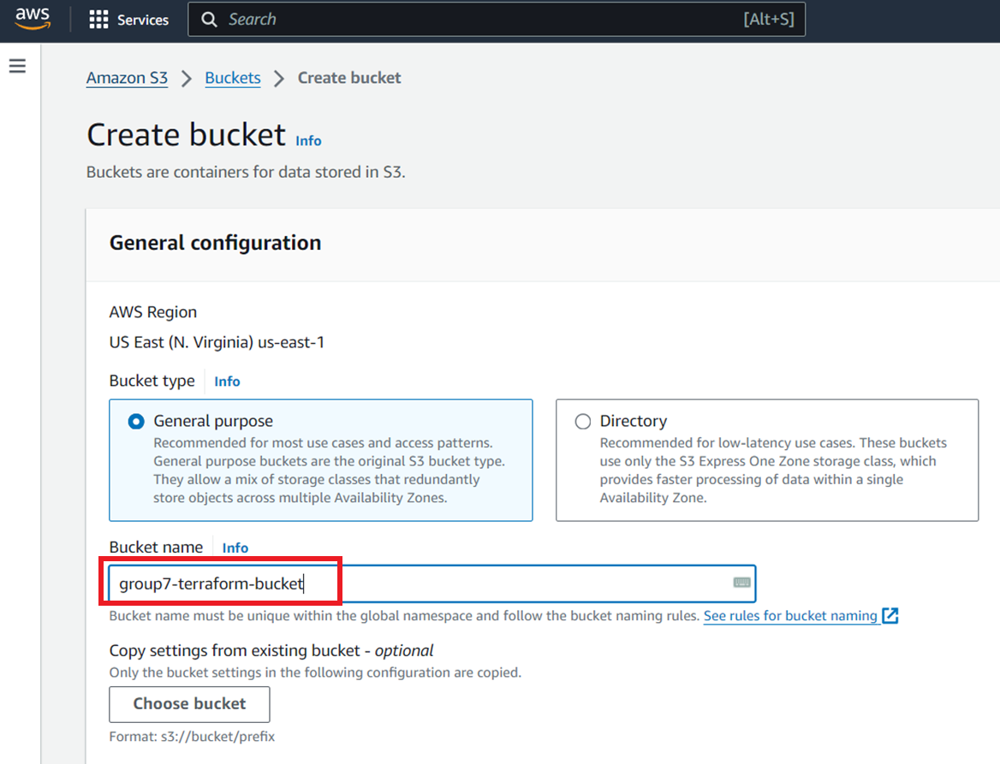
2. **Access S3 Bucket in Terraform**
   
   *This step help us storage file tfstate for management* 
    
   - Go to file main.tf in exercise1/Terraform.
   - Change value following this picture.
   

3. **Create AWS IAM User:**
   - Go to the IAM service in AWS.
   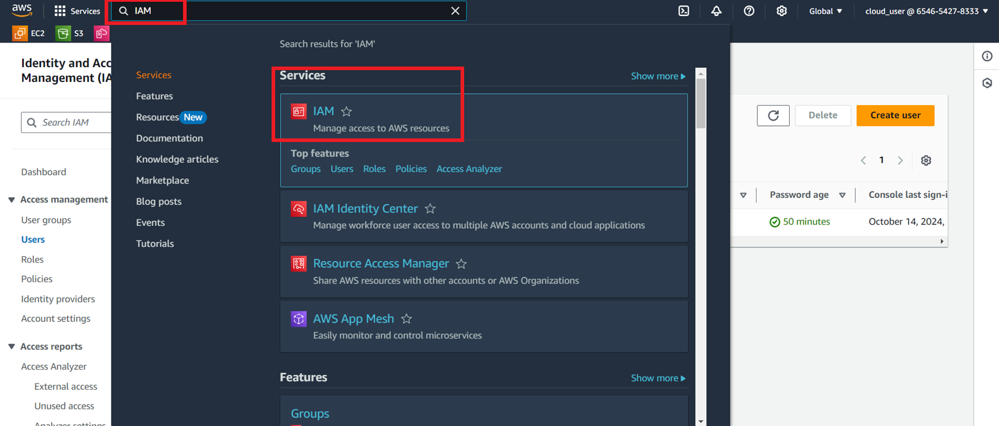

   - Go to ``Users`` section.
   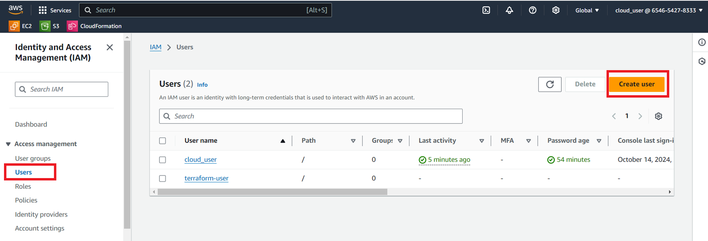

   - Create a new user with your user name.
   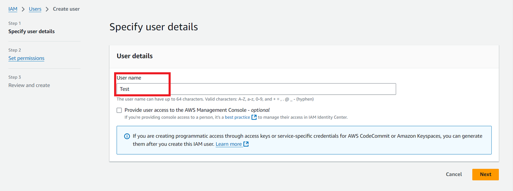

   - Attach the necessary policies.
   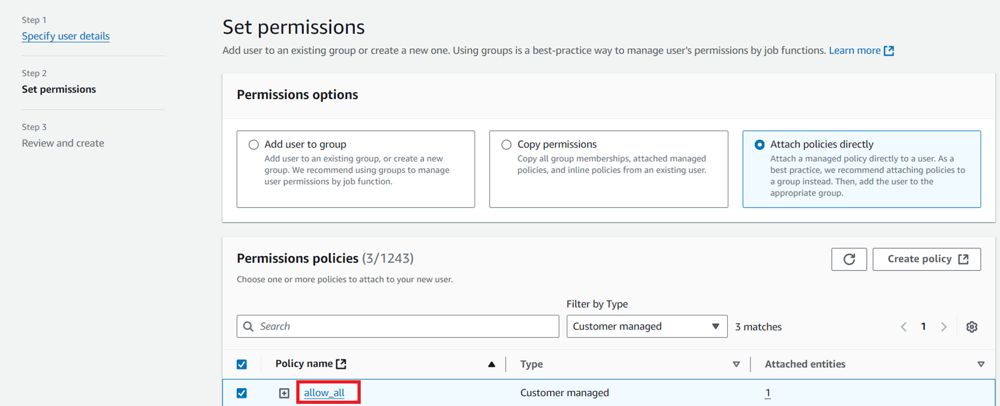

   - Now we can see user created on Dashboard.
   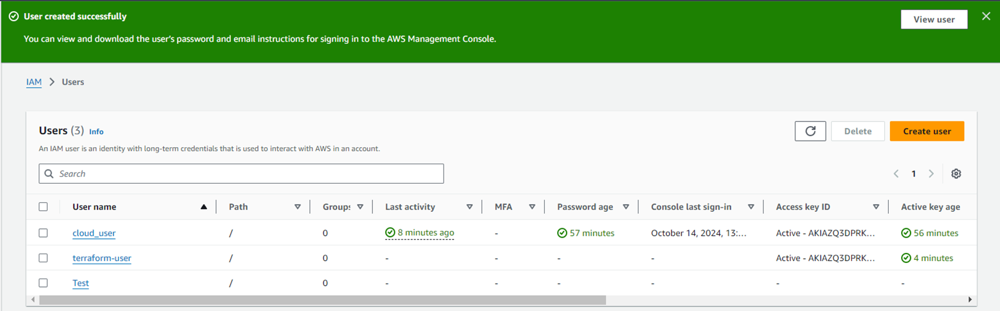

   - Click on the user was created then go to ``Access key 1`` and click ``Create access key``.     
   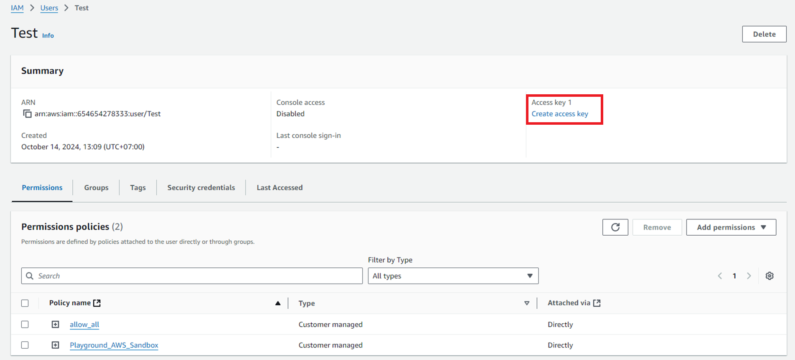

   - Choose ``CLI`` (you can choose ``other`` instead)
   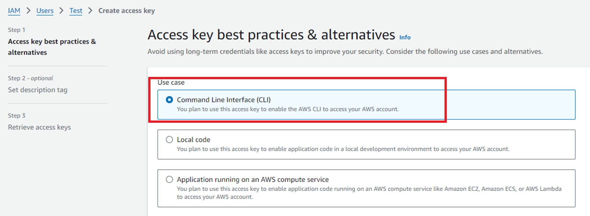

   - After add name tag (optional) , click next and we wil see Retrieve.
   - Click download the CSV file to save the keys or copy them directly.
   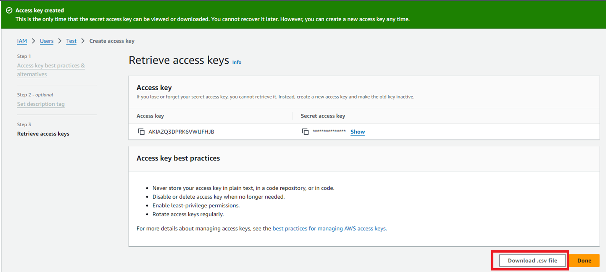

### Connect with ACCESS KEY
1. **Terraform CLI**
   - Go to file locals.tf in exercise1/Terraform
   - Add value Access key and secret key in setup Step (in csv file).
   
   
   - Install Terraform following https://www.youtube.com/watch?v=ThlynejTCWE

   - Then follow this step to use it according to your purpose

      ```sh
      # Initialize a Terraform configuration
      terraform init

      # Validate the configuration files
      terraform validate

      # Generate and show an execution plan
      terraform plan

      # Apply the changes required to reach the desired state of the configuration
      terraform apply

      # Destroy the Terraform-managed infrastructure
      terraform destroy

      # Read an output from a state file
      terraform output

      # Apply the changes without prompting for confirmation
      terraform apply --auto-approve

      # Destroy the infrastructure without prompting for confirmation
      terraform destroy --auto-approve
      ```

2. **Github Action** 
   - Go to the repository settings on GitHub.
   - Go setting and navigate to the "Environments" section.
   
   
   - Create a Environment and add  the following secrets:
     - `AWS_ACCESS_KEY_ID`
     - `AWS_SECRET_ACCESS_KEY`
     - `AWS_REGION` (e.g., `us-east-1`)

     
    
   - In local directory , Go .github/workflow/github-actions-demo-yml.
   - In apply infrastructure, comment ``Destroy`` line following this:
     
   
   - In destroy infrastructure, comment ``Plan-Apply-Clean up`` line following this:
     

## Result

1. **VPC**
   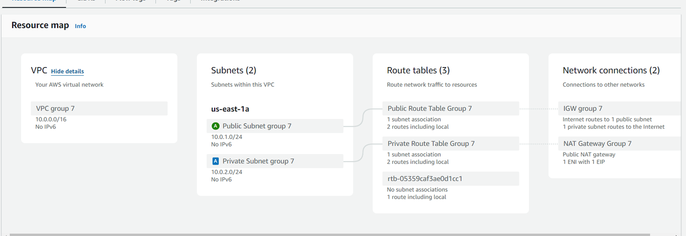

   - VPC: CIDR Block: 10.0.0.0/16
   - Public Subnet: CIDR Block: 10.0.1.0/24
   - Private Subnet: CIDR Block: 10.0.2.0/24
   - Public Route Table:
     + Associated with 1 subnet (public subnet).
     + Contains 2 routes, including a local route.
   - Private Route Table Group 7:
     + Associated with 1 subnet (private subnet).
     + Contains 2 routes, including a local route.
   - Network Connections
      + Internet Gateway (IGW): Provides internet routes to the public subnet and allows private subnet routes to the internet via the NAT gateway.
      + NAT Gateway: Public NAT gateway, with 1 Elastic Network Interface (ENI) and 1 Elastic IP (EIP)

2. **Security Group**
   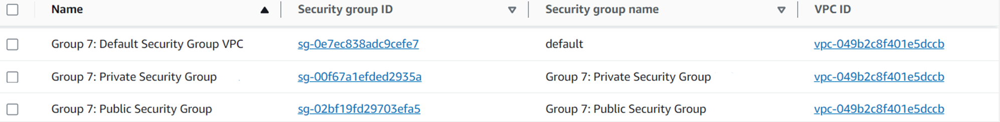
   - Default Security group (no rule)
   - Public Security group (allow ssh in all IP, allow all outbound traffic)
   - Private Security group ()

3. **EC2**
   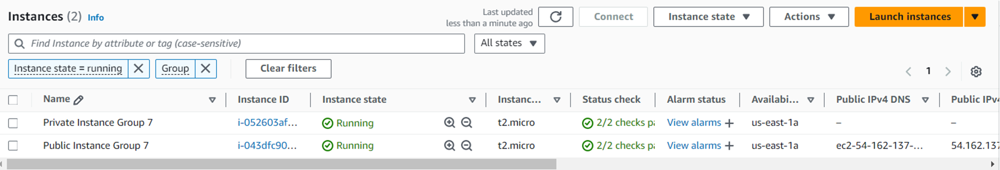

   - Public instance: can access internet , have IP public
   - Private instance: don't have IP public, only access with Public instance with ssh.
